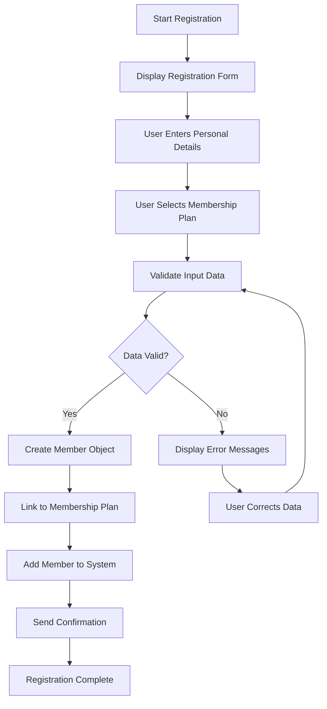
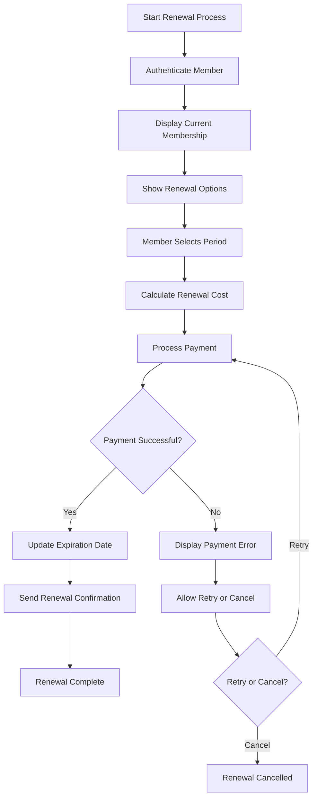
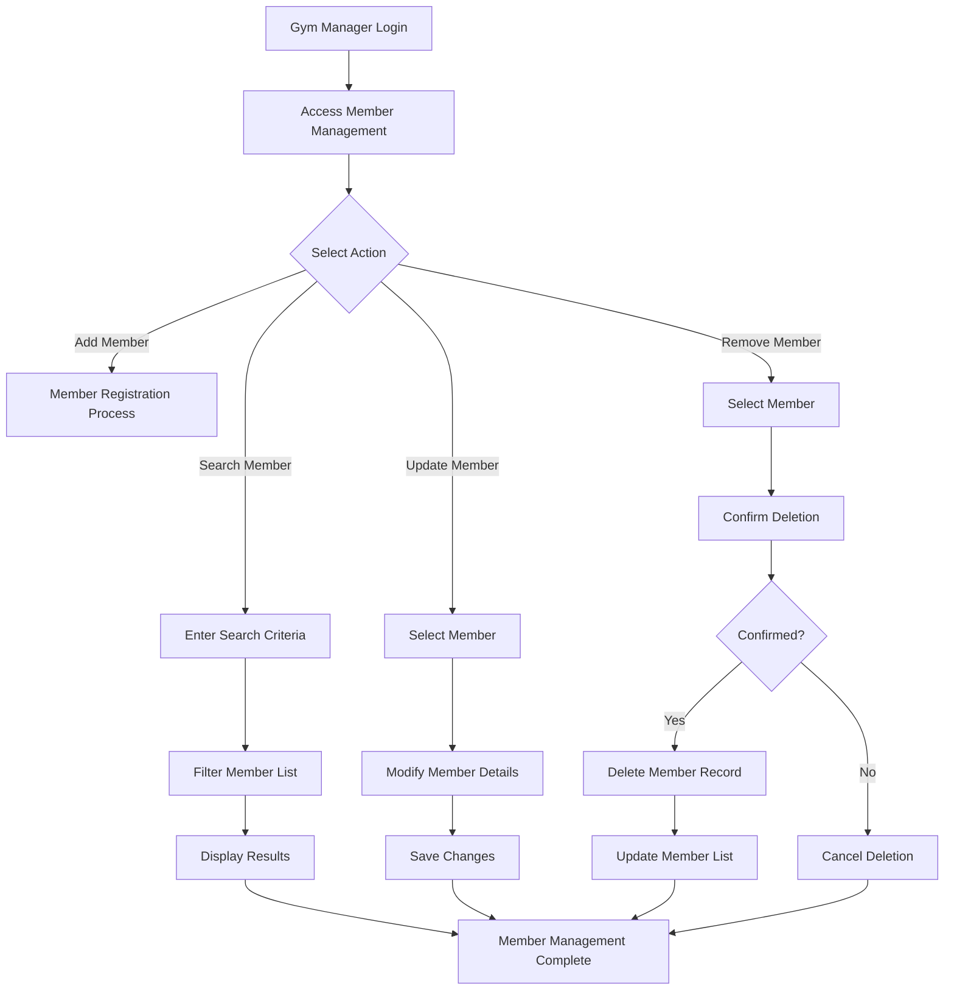
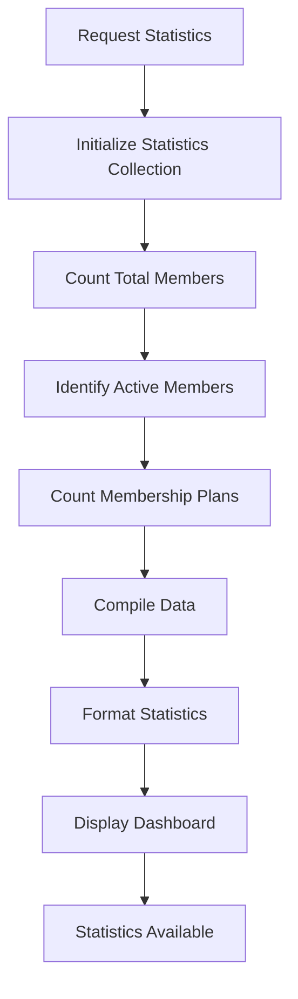

# Infinity Gym - Activity Diagrams

## Overview
This document describes the workflow and business processes of the Infinity Gym management system using activity diagrams.

## Activity Diagrams

### Member Registration Activity

### Membership Renewal Activity

### Member Management Activity

### Statistics Generation Activity

## Detailed Activity Descriptions

### Member Registration Workflow
The member registration workflow represents the complete process a new customer goes through to become a gym member:

1. **Start Registration**: The process begins when a user decides to register for gym membership
2. **Display Registration Form**: The system presents a form for collecting user information
3. **User Enters Personal Details**: The user provides personal information such as name, email, and phone number
4. **User Selects Membership Plan**: The user chooses from available membership options
5. **Validate Input Data**: The system checks all entered data for completeness and correctness
6. **Data Validation Decision Point**: 
   - If data is valid, the process continues to member creation
   - If data is invalid, error messages are displayed and the user must correct the information
7. **Create Member Object**: A new Member object is instantiated with the validated data
8. **Link to Membership Plan**: The member is associated with their chosen membership plan
9. **Add Member to System**: The new member record is stored in the system's member collection
10. **Send Confirmation**: A confirmation message is sent to the user
11. **Registration Complete**: The registration process ends successfully

### Membership Renewal Workflow
The membership renewal workflow describes how existing members extend their membership:

1. **Start Renewal Process**: An existing member initiates the renewal process
2. **Authenticate Member**: The system verifies the member's identity
3. **Display Current Membership**: The system shows the member's current membership details
4. **Show Renewal Options**: Available renewal periods and costs are presented
5. **Member Selects Period**: The member chooses how long to extend their membership
6. **Calculate Renewal Cost**: The system computes the total cost based on selection
7. **Process Payment**: Payment processing begins
8. **Payment Success Decision Point**:
   - If payment succeeds, the membership is updated
   - If payment fails, an error is displayed
9. **Update Expiration Date**: The member's membership expiration date is extended
10. **Send Renewal Confirmation**: A confirmation of successful renewal is sent
11. **Renewal Complete**: The renewal process ends successfully
12. **Payment Error Handling**: If payment fails, the user can choose to retry or cancel
13. **Retry or Cancel Decision Point**:
    - If retry is selected, payment processing repeats
    - If cancel is selected, the renewal process terminates

### Member Management Workflow
The member management workflow represents administrative tasks performed by gym managers:

1. **Gym Manager Login**: The gym manager authenticates to access the system
2. **Access Member Management**: The manager navigates to the member management section
3. **Select Action Decision Point**: The manager chooses what type of action to perform:
   - Add Member: Initiates the member registration process
   - Search Member: Allows finding specific members
   - Update Member: Permits modifying existing member information
   - Remove Member: Enables deleting member records
4. **Add Member Path**: Follows the member registration workflow
5. **Search Member Path**: 
   - Enter Search Criteria: Manager specifies search parameters
   - Filter Member List: System applies filters to the member collection
   - Display Results: Matching members are shown
6. **Update Member Path**:
   - Select Member: Manager chooses which member to modify
   - Modify Member Details: Manager makes changes to member information
   - Save Changes: Updated information is stored
7. **Remove Member Path**:
   - Select Member: Manager chooses which member to delete
   - Confirm Deletion: System asks for confirmation
   - Confirmed Decision Point:
     - If confirmed, the member record is deleted
     - If not confirmed, deletion is cancelled
8. **Member Management Complete**: All paths converge to indicate completion

### Statistics Generation Workflow
The statistics generation workflow shows how the system collects and presents analytical data:

1. **Request Statistics**: A user requests to view statistical information
2. **Initialize Statistics Collection**: The system prepares to gather data
3. **Count Total Members**: The system tallies all registered members
4. **Identify Active Members**: The system filters to find currently active members
5. **Count Membership Plans**: The system counts available membership options
6. **Compile Data**: All collected information is assembled
7. **Format Statistics**: Data is prepared for visual presentation
8. **Display Dashboard**: Statistical information is presented to the user
9. **Statistics Available**: The process completes with accessible statistical data