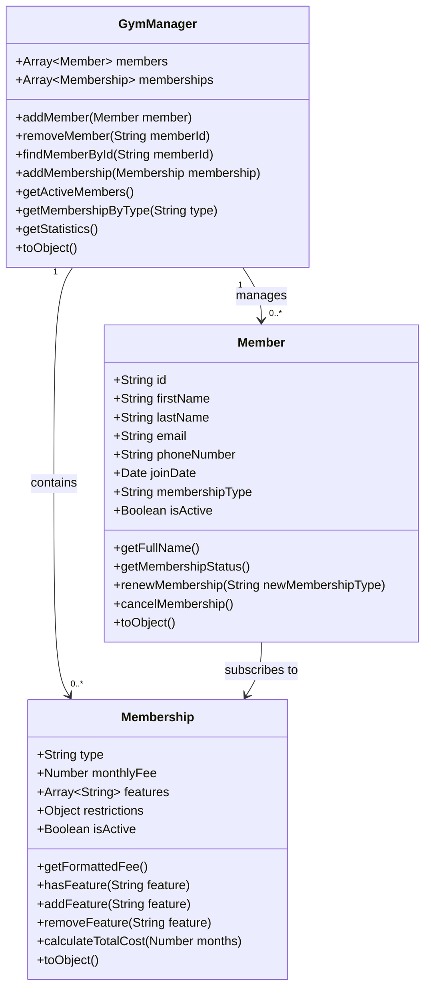

# Infinity Gym - Class Diagram

## Overview
This document describes the class structure of the Infinity Gym management system, showing the relationships between different entities in the system.

## Class Diagram

## Class Descriptions

### Member Class
Represents a gym member with personal information and membership details.

**Attributes:**
- `id`: Unique identifier for the member
- `firstName`: Member's first name
- `lastName`: Member's last name
- `email`: Member's email address
- `phoneNumber`: Member's phone number
- `joinDate`: Date the member joined the gym
- `membershipType`: Type of membership (Basic, Standard, Premium)
- `isActive`: Status of the membership (active/inactive)

**Methods:**
- `getFullName()`: Returns the member's full name
- `getMembershipStatus()`: Returns the membership status
- `renewMembership()`: Renews the member's membership
- `cancelMembership()`: Cancels the member's membership
- `toObject()`: Exports member information as an object

### Membership Class
Represents a gym membership plan with pricing and features.

**Attributes:**
- `type`: Membership type (Basic, Standard, Premium)
- `monthlyFee`: Monthly fee for the membership
- `features`: List of features included in the membership
- `restrictions`: Any restrictions for this membership type
- `isActive`: Status of the membership plan

**Methods:**
- `getFormattedFee()`: Returns the formatted monthly fee
- `hasFeature()`: Checks if the membership includes a specific feature
- `addFeature()`: Adds a feature to the membership
- `removeFeature()`: Removes a feature from the membership
- `calculateTotalCost()`: Calculates the total cost for a given number of months
- `toObject()`: Exports membership information as an object

### GymManager Class
Manages the gym's members and memberships.

**Attributes:**
- `members`: Collection of Member objects
- `memberships`: Collection of Membership objects

**Methods:**
- `addMember()`: Adds a new member to the gym
- `removeMember()`: Removes a member from the gym
- `findMemberById()`: Finds a member by ID
- `addMembership()`: Adds a new membership plan
- `getActiveMembers()`: Gets all active members
- `getMembershipByType()`: Gets membership plan by type
- `getStatistics()`: Gets statistics about the gym
- `toObject()`: Exports all data as an object