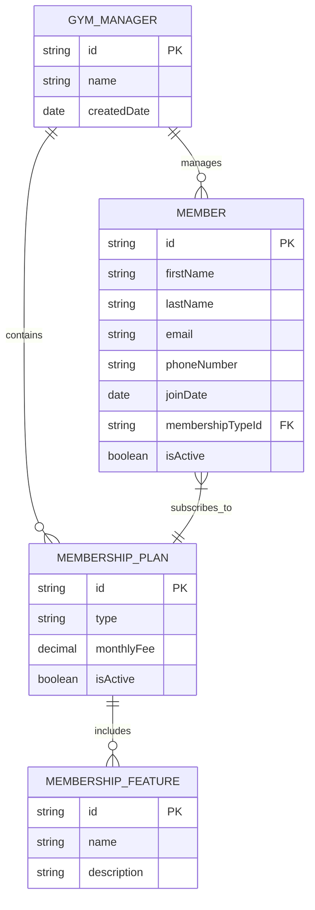

# Infinity Gym - Entity Relationship Diagram

## Overview
This document describes the entity relationships in the Infinity Gym management system, showing how different data entities are connected in the system's database structure.

## ER Diagram

## Entity Descriptions

### GYM_MANAGER Entity
Represents the gym management system itself.

**Attributes:**
- `id` (Primary Key): Unique identifier for the gym
- `name`: Name of the gym
- `createdDate`: Date when the gym management system was created

### MEMBER Entity
Represents a gym member with personal information and membership details.

**Attributes:**
- `id` (Primary Key): Unique identifier for the member
- `firstName`: Member's first name
- `lastName`: Member's last name
- `email`: Member's email address
- `phoneNumber`: Member's phone number
- `joinDate`: Date the member joined the gym
- `membershipTypeId` (Foreign Key): Reference to the membership plan
- `isActive`: Status of the membership (active/inactive)

### MEMBERSHIP_PLAN Entity
Represents a gym membership plan with pricing information.

**Attributes:**
- `id` (Primary Key): Unique identifier for the membership plan
- `type`: Membership type (Basic, Standard, Premium)
- `monthlyFee`: Monthly fee for the membership
- `isActive`: Status of the membership plan

### MEMBERSHIP_FEATURE Entity
Represents features available in membership plans.

**Attributes:**
- `id` (Primary Key): Unique identifier for the feature
- `name`: Name of the feature
- `description`: Description of what the feature provides

## Relationships

### GYM_MANAGER to MEMBER (1:M)
One gym manager manages many members. This represents the relationship between the gym management system and its members.

### GYM_MANAGER to MEMBERSHIP_PLAN (1:M)
One gym manager contains many membership plans. This represents the relationship between the gym and the different membership options it offers.

### MEMBER to MEMBERSHIP_PLAN (N:1)
Many members subscribe to one membership plan. This represents the relationship between members and their chosen membership plan.

### MEMBERSHIP_PLAN to MEMBERSHIP_FEATURE (M:N)
Many membership plans include many features. This represents the relationship between membership plans and the features they offer.