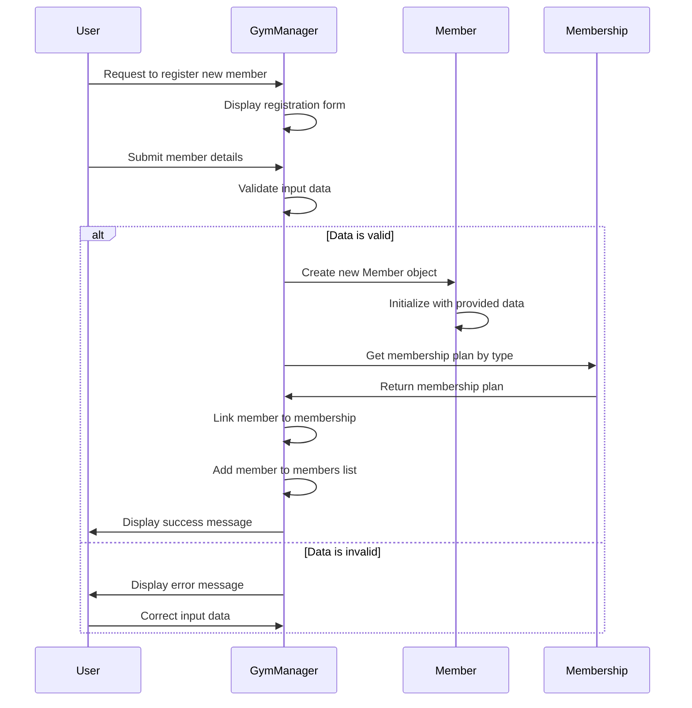
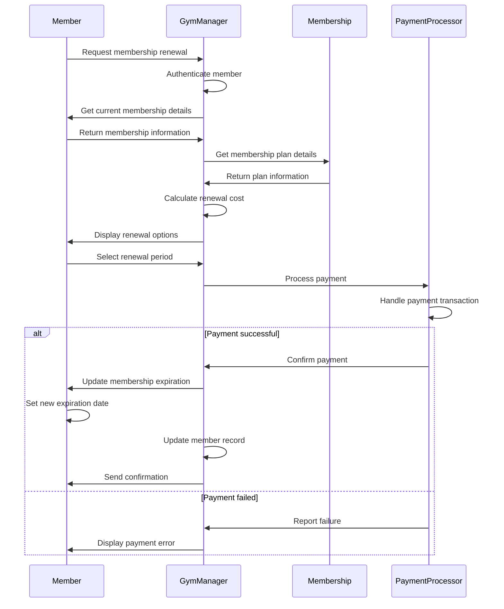
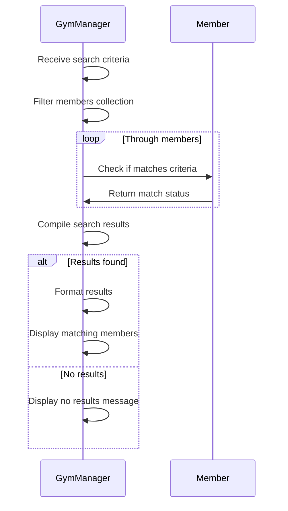
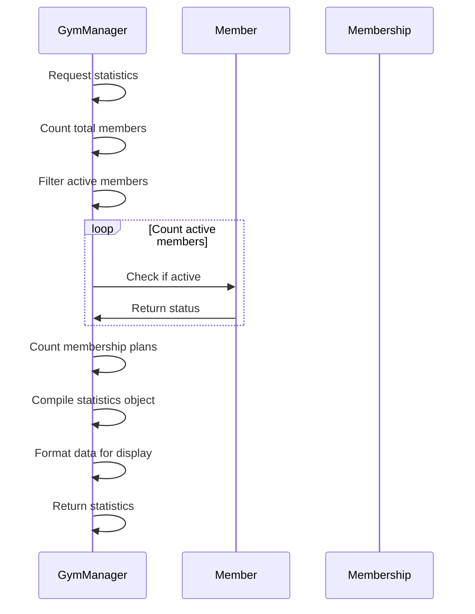

# Infinity Gym - Sequence Diagrams

## Overview
This document describes the sequence of interactions between objects in the Infinity Gym management system for various key operations.

## Sequence Diagrams

### Member Registration Sequence

### Membership Renewal Sequence

### Member Search Sequence

### Statistics Generation Sequence

## Detailed Sequence Descriptions

### Member Registration Process
1. User initiates registration by accessing the registration form
2. GymManager displays the registration form to the user
3. User submits personal details and membership preference
4. GymManager validates all input data for correctness
5. If validation passes:
   - GymManager creates a new Member object with provided data
   - GymManager retrieves the appropriate Membership plan
   - GymManager links the member to their chosen membership plan
   - GymManager adds the new member to the members collection
   - System confirms successful registration to the user
6. If validation fails:
   - System displays error messages
   - User corrects the input data and resubmits

### Membership Renewal Process
1. Member requests to renew their membership
2. GymManager authenticates the member's identity
3. GymManager retrieves current membership details from the Member object
4. GymManager gets the full membership plan details
5. System calculates renewal cost based on selected period
6. Member selects their preferred renewal period
7. System processes payment through the PaymentProcessor
8. If payment succeeds:
   - PaymentProcessor confirms the transaction
   - GymManager updates the membership expiration date
   - Member object saves the new expiration date
   - GymManager updates the member record in the system
   - System sends confirmation to the member
9. If payment fails:
   - PaymentProcessor reports the failure
   - System displays payment error to the member

### Member Search Process
1. GymManager receives search criteria from user
2. GymManager filters the members collection based on criteria
3. For each member in the collection:
   - GymManager checks if the member matches the search criteria
   - Member returns match status to GymManager
4. GymManager compiles all matching results
5. If matches are found:
   - GymManager formats the results for display
   - GymManager presents the matching members to the user
6. If no matches are found:
   - GymManager displays a "no results" message

### Statistics Generation Process
1. GymManager receives request for statistics
2. GymManager counts total members in the system
3. GymManager filters the members collection to find active members
4. For each member:
   - GymManager checks if the member is active
   - Member returns their status to GymManager
5. GymManager counts the total number of membership plans
6. GymManager compiles all collected data into a statistics object
7. GymManager formats the data for user display
8. GymManager returns the final statistics to the requesting user