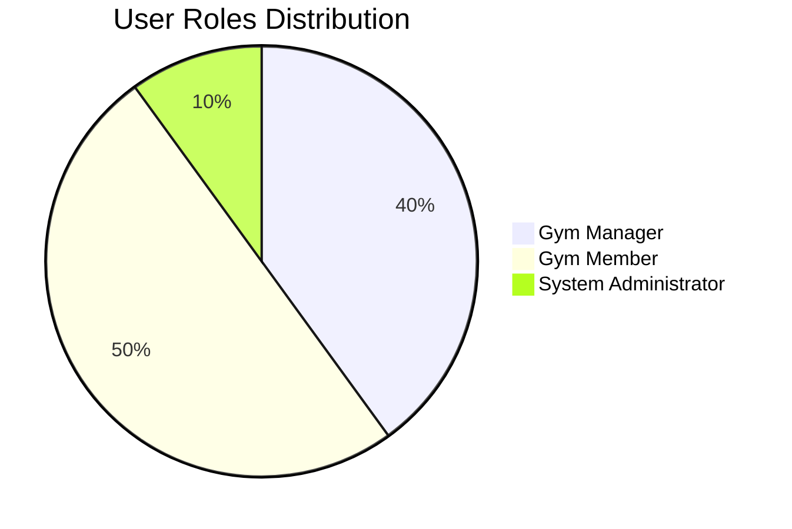
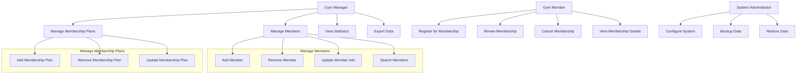

# Infinity Gym - Use Case Diagram

## Overview
This document describes the use cases of the Infinity Gym management system from a user perspective, showing the interactions between different actors and system functionalities.

## Use Case Diagram

## Actors

### Gym Manager
The primary user responsible for managing the gym's daily operations:
- Manages member registrations and information
- Maintains membership plans and pricing
- Views statistical reports
- Exports data for backup or analysis

### Gym Member
Individuals who have registered for gym membership:
- Register for new memberships
- Renew existing memberships
- Cancel memberships when needed
- View their membership details and benefits

### System Administrator
Technical personnel responsible for system maintenance:
- Configure system settings
- Perform data backup operations
- Restore data when needed

## Use Cases

### Manage Members
The gym manager can perform various operations on member records:
- **Add Member**: Register a new member in the system
- **Remove Member**: Delete a member record from the system
- **Update Member Info**: Modify existing member information
- **Search Members**: Find members by various criteria

### Manage Membership Plans
The gym manager can manage different membership options:
- **Add Membership Plan**: Create a new membership type with features and pricing
- **Remove Membership Plan**: Delete an existing membership type
- **Update Membership Plan**: Modify features or pricing of existing plans

### Member Operations
Gym members can manage their own membership status:
- **Register for Membership**: Sign up for a new membership plan
- **Renew Membership**: Extend membership duration
- **Cancel Membership**: Terminate membership agreement
- **View Membership Details**: Check current membership benefits and expiration

### Administrative Functions
System administrators handle technical aspects:
- **Configure System**: Adjust system settings and preferences
- **Backup Data**: Create backups of all system data
- **Restore Data**: Recover system data from backups

## Use Case Descriptions

### UC-01: Add Member
**Actor**: Gym Manager
**Description**: Registers a new member in the gym management system
**Preconditions**: Gym manager is logged into the system
**Main Flow**:
1. Gym manager selects "Add Member" option
2. System displays member registration form
3. Gym manager enters member details
4. System validates input data
5. System creates new member record
6. System displays confirmation message

### UC-02: Register for Membership
**Actor**: Gym Member
**Description**: Allows a new customer to register for a gym membership
**Preconditions**: None (public access)
**Main Flow**:
1. Customer accesses membership registration page
2. System displays available membership plans
3. Customer selects desired membership plan
4. Customer fills out personal information form
5. System validates input data
6. System creates member record with selected plan
7. System generates membership confirmation

### UC-03: Renew Membership
**Actor**: Gym Member
**Description**: Extends an existing membership for additional time
**Preconditions**: Member has an active or expired membership
**Main Flow**:
1. Member logs into their account
2. Member selects "Renew Membership" option
3. System displays current membership details
4. Member selects renewal period
5. System calculates renewal cost
6. Member confirms payment
7. System updates membership expiration date
8. System sends confirmation

### UC-04: View Statistics
**Actor**: Gym Manager
**Description**: Displays statistical information about gym membership
**Preconditions**: Gym manager is logged into the system
**Main Flow**:
1. Gym manager selects "View Statistics" option
2. System retrieves membership data
3. System calculates statistical metrics
4. System displays statistics dashboard
5. Gym manager views membership trends and metrics